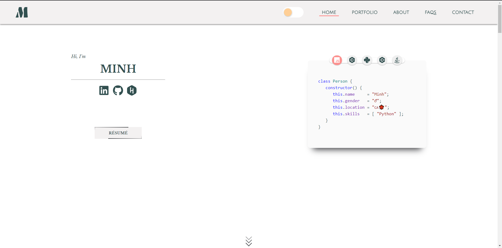
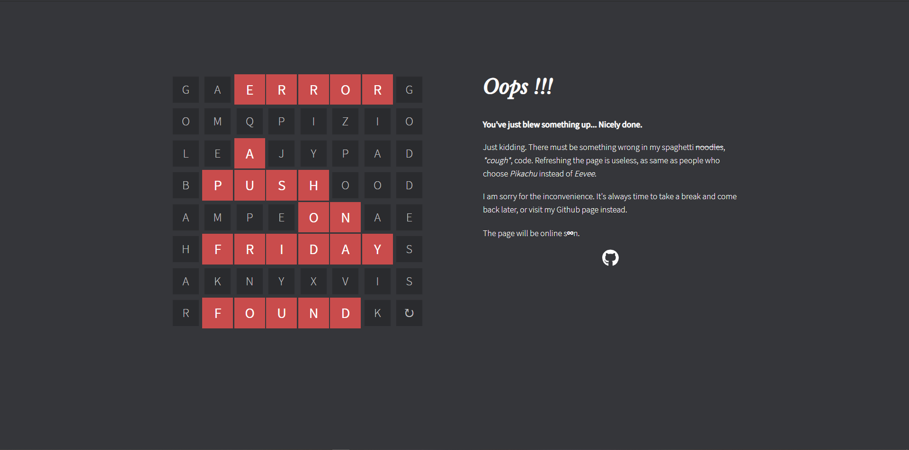

<h3 align="center">
<a href="https://minhvo-dev.github.io">
    
    <h3>https://minhvo-dev.github.io</h3>

<h3>

<h3 align="center">Portfolio Site | Made by ✋ <h3>

## Changelog

### Version 1.5.2 - 10/08/2021
- Added auto-hide navbar

### Version 1.5.1 - 08/08/2021
- Fixed loading screen
- Fixed contact form 

### Version 1.5.0 - 08/08/2021
- Fixed error matrix
- Updated styling on main page
- Added dark mode

### Version 1.4.0 - 02/08/2021
- Added error page

### Version 1.3.6 - 13/05/2021
- Fixed social icons in front page shrink due to the hidden availability line

### Version 1.3.5 - 14/04/2021
- Added Minhsenger™ app
- Added robots.txt
- Updated frontpage screenshot
- Reorganized imgs

### Version 1.3.4 - 10/04/2021
- Added Contacts+ app
- Modified h1 and h2 tags
- Fixed skill-icon class
- Removed title in home page

### Version 1.3.3 - 31/03/2021
- Added Greedy Game
- Removed Twitter and Facebook links
- Modified `social-container` and `social-bag-container`

### Version 1.3.2 - 12/03/2021
- Added Worldwide Travel Alert app
- Removed descriptions of toys
- Fixed Patientor app link

### Version 1.3.1 - 01/03/2021
- Fixed fetch query

### Version 1.3.0 - 25/02/2021
- Added loading screen
- Fetched data

### Version 1.2.3 - 20/02/2021
- Added some meta tags
- Animated texts are no longer in random order

### Version 1.2.2 - 16/02/2021
- Added Google Search meta tag

### Version 1.2.1 - 14/02/2021
- Added Patientor app
- Fixed typo
- Removed unnecessary resources

### Version 1.2 - 23/01/2021   
- Fixed noscript not full screen size
- Changed "toys" description
- Added Rate Repository App
- Added new languages, framewords and tools
- Added new dialog in FAQs
- Added 2021 to footer
